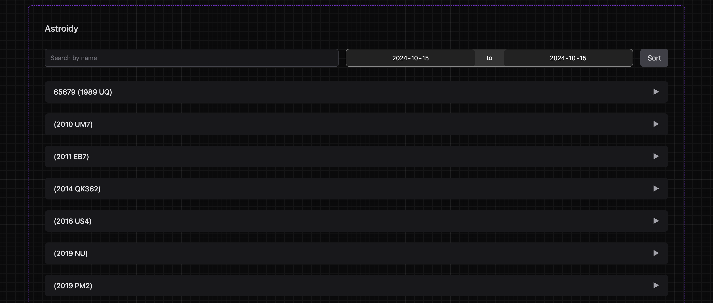

# Astroidy

**[Live Demo](https://astroidy.scaccoman.com)**

Astroidy is a full-stack application designed to display information about asteroids. This project is a technical challenge that demonstrates best practices and code reusability while providing a fun and engaging experience.



## Features

- **Display a list of asteroids:** View a comprehensive list of asteroids fetched from NASA's API.
- **Search by a range of dates:** Filter asteroids by specifying a start and end date.
- **Asteroid details:** Click on an asteroid to see detailed information.
- **Sort by name:** Sort the list of asteroids alphabetically by name.

## Tech Stack

- **Frontend:** React.js, Next.js
- **Backend:** Node.js
- **API:** [NASA's NeoWs (Near Earth Object Web Service)](https://api.nasa.gov/neo/rest/v1/feed?start_date=2015-09-07&end_date=2015-09-08&api_key=DEMO_KEY)

## Getting Started

### Prerequisites

- Node.js v20 LTS
- pnpm

### Installation

1. Clone the repository:

```sh
git clone https://github.com/yourusername/astroidy.git
cd astroidy
```

### Running Locally

1. Use correct Node.js version:

```sh
nvm use
```

2. Install dependencies:

```sh
pnpm install
```

3. Start the dev server:

```sh
pnpm dev
```
